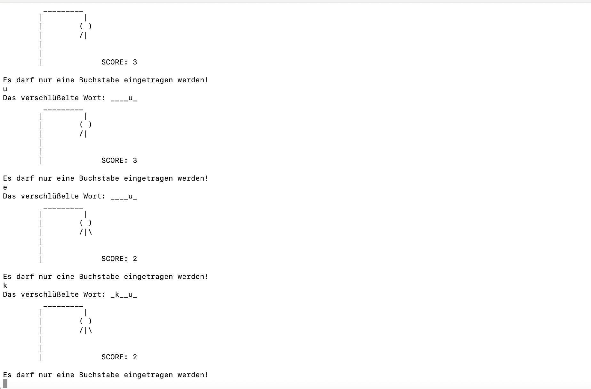

# Hangman Game
A terminal Hangman Game against the computer.

## Before starting
Before you can start the game, you have to install the GNU-Compiler.
- For Mac: XCode
- For Windows: mingw for latest Windows-Version
- For Linux: the GNU C-Compiler is pre-installed with the texteditor of your choice
Some good instructions are available here for all the systems (https://gcc.gnu.org/install/binaries.html)

## Usage
1. Download the main repository.
2. Open the repository in terminal.
3. Start the game firstly with the command `gcc -std=c11 -Wall -Wimplicit-fallthrough -Wpedantic -o game Game.c`. After this with the command `./game`.
When your game is over, you can start it with the same command `./game`. This would generate and riddle one more word that you have to guess.

## Demo
Here how the game looks like.

## Enjoy!
